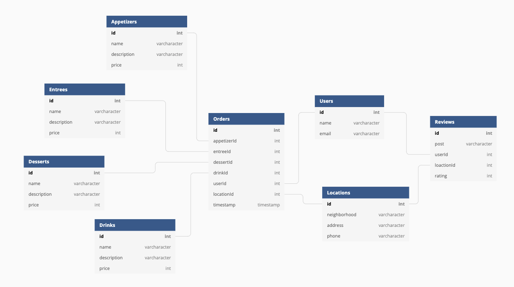

# Nashville Software Speakeasy

<i>Nashvilles hottest new restaraunt is now online!</i> 

## Application Overview

This application will allow users to view locations, menu, place an order, and view/leave reviews for specific locations for this new restaraunt chain!

### Features

<ul>
  <li>users may login or register with an email</li>
  <li>users may view locations and menu of the restaurant</li>
  <li>users may place an order at one of the locations</li>
  <li>users may may see their order history</li>
  <li>users may see all reviews for all locations</li>
  <li>users may post, edit, and delete a review of their own</li>
</ul>

### Running this application

1. Clone this repository and change to the directory in the terminal.

```sh
git clone git@github.com:jmason87/Client-Side-Capstone.git
cd client-side-capstone
```

### Technologies Used

       

### ERD


